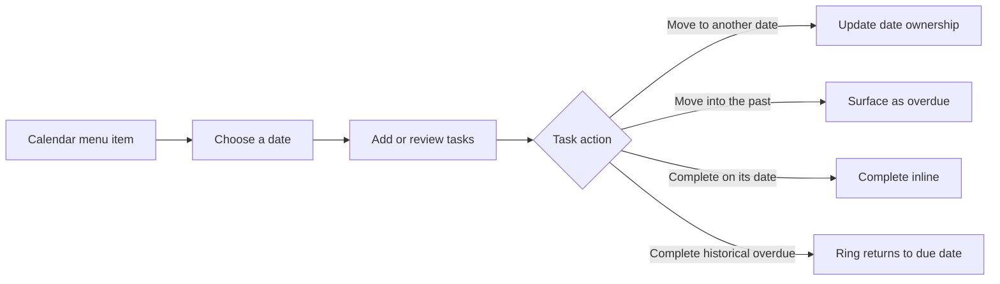

[English](README.en.md) | [简体中文](README.md)

<p align="center">
  
</p>

# Desktop Sentry

A local-first macOS menu-bar utility that brings calendars, daily todos, overdue work,
reusable prompts, and local AI Skill indexes into one quick-access workspace.

Current source release: **2.0.4 build 24 · Calendar V5**.

Desktop Sentry is written in Swift and SwiftUI and requires no account or cloud service.
Settings and the calendar footer display the version, build, and calendar generation;
source previews also include their Git revision so bug reports can identify the exact binary.

## What changed in 2.0.4

- **Overdue work on today's page:** unfinished tasks keep their original due date and are surfaced in today's overdue section.
- **Completed work in context:** each day shows its three most recent completed tasks inline, with an option to reveal all of them.
- **Stable date movement:** tasks can move repeatedly between dates; moving into the past immediately marks them overdue without losing ownership.
- **Complete reminder lifecycle:** moving, completing, restoring, or deleting a task updates its local macOS notification.
- **Reliable row interaction:** date changes no longer leave individual cards dimmed, untappable, or undraggable.
- **Visible binary identity:** releases display `2.0.4 (24) · V5`; source previews additionally show their revision and preview status.

## Motion upgrade

Motion communicates where a task came from and where it belongs; it is not decorative-only feedback.

- A dragged card collapses into a small ring attached to the pointer, then lands directly on the target date without a false intermediate stop.
- Completing a historical overdue task from today's page turns the card into an orange ring that returns to its actual due date.
- Completing a task on its own date stays inline—there is no spatially misleading flight.
- Changing a due date flips only the compact date badge while the containing card remains stable.
- Selection restores the V5 deep-blue fill, in-place blue border, and soft glow. Landing feedback stays about two points beyond the card instead of expanding outward.
- When Reduce Motion is enabled, complex travel is replaced with shorter, restrained feedback.



## Feature map

| Area | Purpose |
| --- | --- |
| Menu-bar calendar | Hover for a quick look or click to pin the calendar and daily-task workspace. |
| Today and overdue | See today's work together with unfinished tasks from earlier dates. |
| Daily todos | Add a title, notes, and an optional reminder, then drag the task to change its date. |
| Completed list | Review, restore, or permanently delete completed work directly under its date. |
| Date indicators | Distinguish active, completed, and multi-task days with rings, dots, and compact counts. |
| Reusable prompts | Find and copy frequently used prompts from the menu bar or search panel. |
| AI Skill index | Scan configured local folders for `SKILL.md` files, then search, categorize, and favorite them. |
| Quick menu | Put up to six selected prompts in a native macOS context menu. |
| Appearance and settings | Follow the system or choose light/dark mode, launch at login, and copy feedback. |

## Using the calendar and todos

1. Click the calendar icon in the menu bar to open and pin the calendar workspace.
2. Choose a date and enter a task on the right; edit it to add notes or an optional reminder.
3. Drag a task card to another date. Dropping it in the past immediately makes it overdue.
4. Click the circle on the left to complete it. Completed tasks remain attached to their date and can be restored.

Long lists remain scrollable without exposing a width-consuming native scrollbar. The composer,
task cards, and footer continue to share the same horizontal guide.

## Other capabilities

- Native macOS menu-bar entries for prompts and the calendar
- Notes, optional reminders, completion, restore, and permanent deletion
- Prompt search, categories, favorites, and a configurable quick menu
- Local `SKILL.md` discovery, deduplication, search, categories, and favorites
- Optional launch at login, copy sounds, and native macOS notifications
- Local JSON storage with no account, analytics, or telemetry

## Requirements

- macOS 14 or later
- Xcode Command Line Tools, including `swiftc`
- Git

Install the command-line tools when needed:

```bash
xcode-select --install
```

## Quick install from source

```bash
git clone https://github.com/langyougoudaner/desktop-sentry-new.git
cd desktop-sentry-new
bash install-from-source.sh
```

The installer compiles the app on the destination Mac, verifies its ad-hoc signature,
copies it to `~/Applications/DesktopSentry.app`, and opens it. No Apple Developer
certificate or downloaded prebuilt binary is required.

To avoid accidental replacement, the installer stops when an app already exists at the
destination. Set `DESKTOP_SENTRY_INSTALL_DIR` to install elsewhere.

## Build without installing

```bash
bash build.sh
open build/DesktopSentry.app
```

There is no `.xcodeproj`, Swift Package manifest, or workspace. `build.sh` explicitly
lists every production Swift file and invokes `swiftc` directly; new production files
must also be added to its `SOURCES=(...)` list.

Run the focused checks used by this release:

```bash
bash Tools/RunFocusedChecks.sh
```

## Data and privacy

Desktop Sentry has no account, advertising, analytics, telemetry, cloud sync, or
application-owned network service. Tasks, prompts, clipboard history, reminders,
settings, and Skill metadata stay in the current user's Application Support directory.

The public repository contains only source, tests, reproducible resources, and sanitized
documentation. It excludes runtime data, personal tasks, screenshots, recordings,
machine-local paths, credentials, backups, and compiled apps. See [PRIVACY.md](PRIVACY.md)
for the full boundary.

## Current limitations

- The app is not signed with an Apple Developer ID or notarized, so the repository currently provides source installation only.
- It is a menu-bar utility (`LSUIElement=true`) and normally does not appear in the Dock.
- Skill recommendations use local keyword matching rather than a semantic model.
- There is no cross-device sync; data remains on the current Mac.

## FAQ

### Why is there no DMG or directly downloadable app?

The project does not currently have an Apple Developer certificate. Source installation
builds and ad-hoc signs the app directly on your Mac instead of distributing an unnotarized binary.

### Why is there no Dock icon after launch?

Desktop Sentry is a menu-bar utility. Look for its prompt entry and calendar icon in the menu bar.

### Are my tasks or prompts uploaded?

No. The app has no service for uploading them, and runtime data is excluded by Git rules
and the mandatory pre-push privacy check.

### Why does the installer say an app already exists?

That safeguard prevents accidental replacement of an existing version and its rollback
path. Keep or move the existing app first, or choose another `DESKTOP_SENTRY_INSTALL_DIR`.

## Project structure

```text
Sources/        Application source
Resources/      Reproducible application icon resources
Tests/          Standalone smoke and state-logic checks
Tools/          Build helpers and the pre-push privacy check
Info.plist      macOS metadata and release identity
build.sh        Reproducible source build
```

## Contributing

Before submitting a change, run at least `bash Tools/RunFocusedChecks.sh` and
`bash build.sh`. Never commit runtime data, screenshots, recordings, build products,
machine-local absolute paths, or credentials.

Bug reports should include the version, build, and calendar generation shown in Settings
or the calendar footer. Source-preview reports should include the displayed Git revision.

## License

Desktop Sentry is available under the [MIT License](LICENSE).
