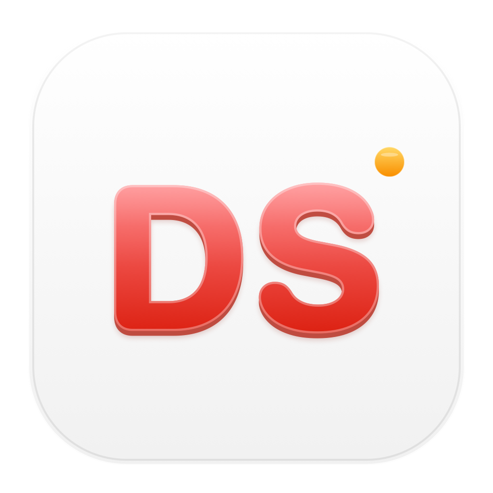
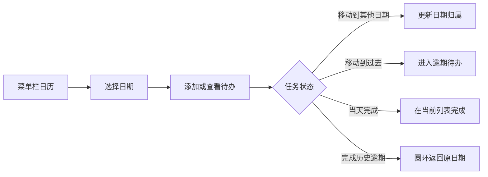

[简体中文](README.md) | [English](README.en.md)

<p align="center">
  
</p>

# Desktop Sentry（桌面哨兵）

一款本地优先的 macOS 菜单栏效率工具：把日历、每日待办、逾期提醒、常用提示词和本地
AI Skill 索引放进一个随时可以打开的入口。

当前源码版本：**2.0.4 build 24 · 日历 V5**。

Desktop Sentry 使用 Swift 与 SwiftUI 开发，不需要账号或云服务。设置页和日历页脚会显示
版本号、构建号和日历代际；源码预览还会显示 Git 修订号，方便准确定位反馈对应的版本。

## 2.0.4 更新了什么

- **逾期待办集中显示**：今天没完成的任务仍归属于原日期，并会在今天页面的“逾期”区域提醒你。
- **已完成内容直接可见**：每天的列表内直接显示最近 3 条已完成任务，需要时可以展开全部内容。
- **日期移动逻辑重做**：待办可以在不同日期之间反复移动；移动到过去后会立即变成逾期待办，日期归属不会消失。
- **提醒逻辑补全**：移动、完成、恢复或删除任务时会同步更新对应的 macOS 本地通知。
- **列表交互修复**：卡片保持可点击、可完成和可拖动，不再因日期变化进入不可操作的灰色状态。
- **版本身份可见**：正式版显示 `2.0.4 (24) · V5`，源码预览额外显示修订号和预览标记。

## 本次动效升级

动效不只是装饰，它负责说明一条待办“从哪里来、现在归属于哪里”。

- 拖动开始后，卡片缩成吸附鼠标的小圆环；松手后圆环直接进入目标日期，不经过虚假落点。
- 从今天页面完成一条历史逾期待办时，卡片先收成橙色圆环，再回到它真正所属的历史日期。
- 当天待办完成时只在当前列表内完成，不播放没有空间意义的飞行动画。
- 修改待办日期时只翻动日期标签，卡片主体保持稳定，减少任务较少时整张卡片翻转的突兀感。
- 卡片选中后恢复 V5 的深蓝填充、原位蓝色边框和柔光；拖动落位光效固定在卡片外围约 2pt，
  不再向外过度生长。
- 系统开启“减少动态效果”时，复杂移动会自动替换为更短、更克制的反馈。



## 功能一览

| 板块 | 作用 |
| --- | --- |
| 菜单栏日历 | 悬停快速查看，点击后固定打开日历与每日待办工作台。 |
| 今日与逾期 | 在今天页面同时看到今天的任务和仍未完成的历史任务。 |
| 每日待办 | 为任意日期添加标题、说明和可选提醒，并通过拖动调整日期。 |
| 已完成列表 | 在对应日期下直接查看、恢复或永久删除已完成任务。 |
| 日期状态 | 用圆环、实心点和数量标记区分未完成、已完成及多任务日期。 |
| 常用提示词 | 从菜单栏或搜索面板快速找到并复制经常使用的提示词。 |
| AI Skill 索引 | 扫描本机指定目录中的 `SKILL.md`，支持搜索、分类和收藏。 |
| 快捷菜单 | 选择最多 6 条常用提示词，放入 macOS 原生右键菜单。 |
| 外观与设置 | 支持跟随系统、浅色和深色外观，以及开机启动和复制音效。 |

## 日历与待办怎么用

1. 点击菜单栏中的日历图标，打开并固定日历工作台。
2. 选择日期，在右侧输入待办标题；需要更多信息时可继续编辑说明和提醒时间。
3. 按住待办卡片拖向另一个日期，松手后它会归属于新的日期；拖到过去则自动标记为逾期。
4. 点击卡片左侧圆圈完成任务；已完成任务仍保留在对应日期，可随时恢复。

列表较长时可以继续滚动，但不会显示占用宽度的原生滚动条；输入框、卡片和页脚始终使用同一条
左右边界。

## 其他能力

- 原生 macOS 菜单栏提示词入口和独立日历入口
- 待办说明、可选提醒、完成、恢复和永久删除
- 常用提示词搜索、分类、收藏和自定义快捷菜单
- 本地 `SKILL.md` 发现、去重、搜索、分类和收藏
- 可选开机启动、复制音效和 macOS 原生通知
- 本地 JSON 数据存储，无账号、无分析、无遥测

## 系统要求

- macOS 14 或更高版本
- Xcode Command Line Tools，其中需要包含 `swiftc`
- Git

如果尚未安装命令行工具，请运行：

```bash
xcode-select --install
```

## 从源码快速安装

```bash
git clone https://github.com/langyougoudaner/desktop-sentry-new.git
cd desktop-sentry-new
bash install-from-source.sh
```

安装脚本会在当前 Mac 上编译 APP、验证临时签名、复制到
`~/Applications/DesktopSentry.app`，然后打开它。因为 APP 在本机编译，所以不需要
Apple Developer 证书或预编译安装包。

为避免误覆盖，目标位置已有同名 APP 时脚本会停止。需要安装到其他目录时，可以设置
`DESKTOP_SENTRY_INSTALL_DIR`。

## 只构建，不安装

```bash
bash build.sh
open build/DesktopSentry.app
```

项目没有 `.xcodeproj`、Swift Package 清单或 workspace。`build.sh` 会显式列出所有生产
Swift 文件并直接调用 `swiftc`；新增生产文件时也必须加入脚本中的 `SOURCES=(...)`。

运行本次版本的专项检查：

```bash
bash Tools/RunFocusedChecks.sh
```

## 数据与隐私

Desktop Sentry 没有账号、广告、分析、遥测、云同步或应用自有网络服务。待办、提示词、
复制历史、提醒、设置和 Skill 索引都保留在当前 Mac 的 Application Support 目录中。

公开仓库只包含源码、测试、可复现资源和脱敏说明，不包含运行数据、个人任务、截图、录屏、
本机路径、凭据、备份或编译后的 APP。完整边界请查看 [PRIVACY.md](PRIVACY.md)。

## 当前限制

- 当前没有经过 Apple Developer ID 签名或 Apple 公证，因此仓库只提供源码安装方式。
- 这是菜单栏应用（`LSUIElement=true`），正常情况下不会出现在 Dock 中。
- Skill 推荐目前基于本地关键词匹配，不是语义模型。
- 应用没有跨设备同步；数据只保存在当前 Mac。

## 常见问题

### 为什么没有 DMG 或可直接下载的 APP？

项目目前没有 Apple Developer 证书。源码安装会直接在你的 Mac 上完成编译和临时签名，避免分发一个
未经公证的预编译包。

### 为什么打开后 Dock 里没有图标？

Desktop Sentry 是菜单栏工具，请在屏幕顶部菜单栏寻找提示词入口和日历图标。

### 我的待办和提示词会上传吗？

不会。应用没有上传这些数据的网络服务，运行数据也被 Git 忽略规则和推送前隐私检查排除。

### 为什么安装脚本提示已有同名 APP？

这是防止覆盖现有版本和数据回滚路径的保护措施。请先保留或移动旧 APP，或者为新版本指定不同的
`DESKTOP_SENTRY_INSTALL_DIR`。

## 项目结构

```text
Sources/        应用程序源码
Resources/      可重新生成的应用图标资源
Tests/          独立 Swift 冒烟与状态逻辑检查
Tools/          构建辅助和推送前隐私检查
Info.plist      macOS 应用元数据与版本号
build.sh        可复现的源码构建脚本
```

## 参与开发

提交改动前，请至少运行 `bash Tools/RunFocusedChecks.sh` 和 `bash build.sh`。不要提交用户运行数据、
截图、录屏、编译产物、本机绝对路径或凭据。

问题反馈请同时提供设置页或日历页脚显示的版本号、构建号和日历代际；源码预览还应提供 Git 修订号。

## 开源许可证

Desktop Sentry 使用 [MIT License](LICENSE) 开源。
